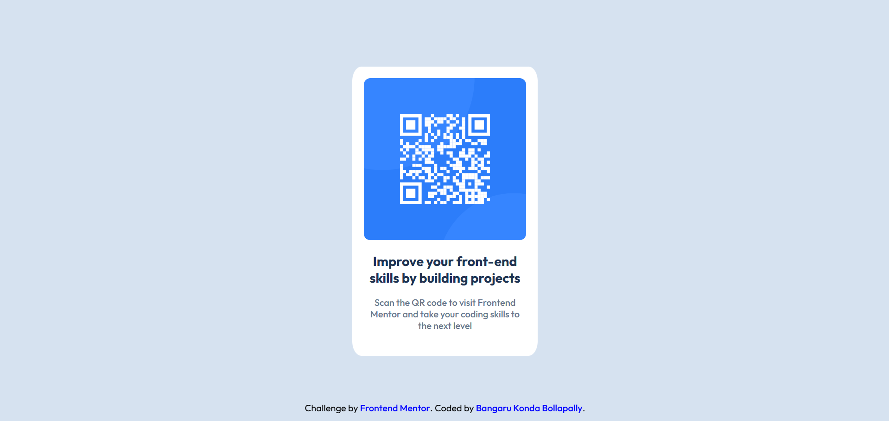

# Frontend Mentor - QR code component solution

This is a solution to the [QR code component challenge on Frontend Mentor](https://www.frontendmentor.io/challenges/qr-code-component-iux_sIO_H). Frontend Mentor challenges help you improve your coding skills by building realistic projects.

## Table of contents

- [Overview](#overview)
  - [Screenshot](#screenshot)
  - [Links](#links)
- [My process](#my-process)
  - [Built with](#built-with)
  - [What I learned](#what-i-learned)
  - [Continued development](#continued-development)
- [Author](#author)

## Overview

### Screenshot



### Links

- Solution URL: [Add your Frontend Mentor solution URL here]
- Live Site URL: [https://qr-component-beta-neon.vercel.app/]

## My process

### Built with

- Semantic HTML5 markup
- CSS custom properties (`:root` variables for colors)
- Flexbox
- Mobile-first media query
- `box-sizing: border-box`

### What I learned

This was my first real Frontend Mentor challenge, and it exposed a gap I didn't know I had — I could follow CSS tutorials, but I struggled to center the card on my own at first. Working through it taught me to actually trust flexbox instead of reaching for `position: absolute` as a default fix.

Centering the whole card using flexbox on the parent:

```css
body {
  min-height: 100vh;
  display: flex;
  justify-content: center;
  align-items: center;
}
```

I initially tried to fix small-screen layout using `position: absolute` inside my media query, which broke the flex centering I already had working at desktop size. Removing it and letting the flex parent handle positioning at every screen size was the actual fix — not adding more positioning rules.

```css
/* Before: fighting the layout */
@media (max-width: 375px) {
  .main {
    position: absolute;
    width: 80%;
    height: 65%;
  }
}

/* After: trusting flexbox, adjusting only sizing */
@media (max-width: 375px) {
  .main {
    width: 80%;
  }
}
```

I also learned that fixed pixel `width`/`height` on a container fights against responsiveness — using `width: 90%` with `max-width` (and letting height stay `auto`, sized by content + padding) holds up much better across screen sizes than hardcoded `px` values.

### Continued development

- Get comfortable removing fixed `height` values and trusting content + padding to size containers naturally
- Practice more breakpoints (not just one at 375px) — test tablet-sized viewports (~768px) too
- Stop reaching for `position: absolute` as a default fix when something doesn't look centered — check the parent's `display` and alignment properties first
- Build more Frontend Mentor challenges at increasing difficulty before moving on to JavaScript-based components

## Author

- Frontend Mentor - [@bangarukondabollapally](https://www.frontendmentor.io/profile/bangarukondabollapally)
- GitHub - [@bangarukondabollapally](https://github.com/bangarukondabollapally)